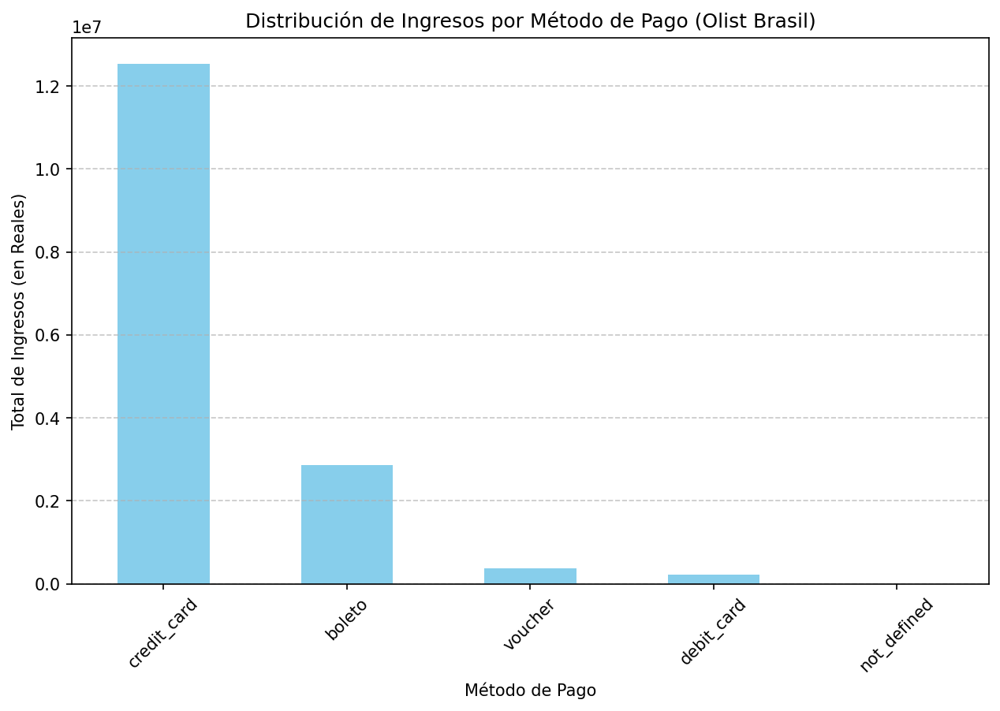
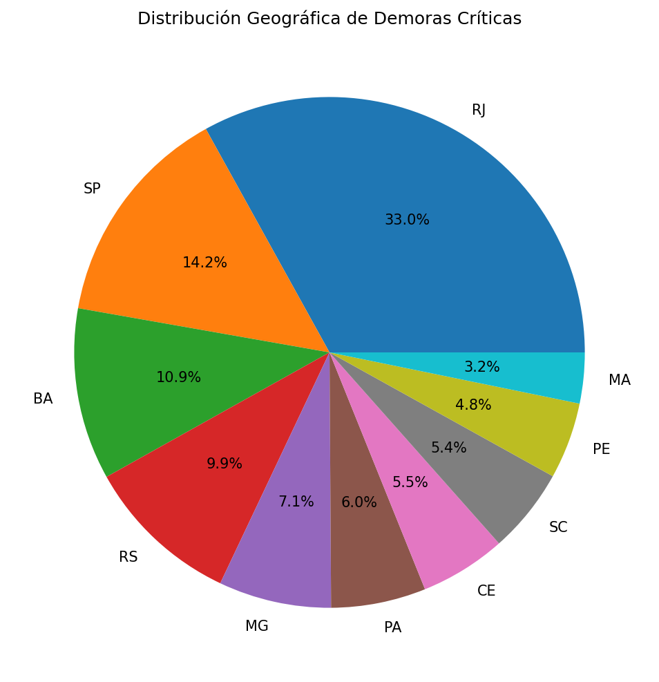

# 📊 Auditoría de Integridad y Performance — E-commerce Olist (Brasil)


**Autor:** Jonathan Monserrat  
**Stack:** Python · pandas · Matplotlib · Seaborn  
**Datos:** 99.441 órdenes · 103.886 registros de pago · Dataset público Olist (Kaggle)

---

## 📌 Descripción

Auditoría de integridad de datos y análisis de performance logística sobre el dataset público de Olist, el mayor e-commerce de Brasil. El análisis aplica criterios de auditoría contable para cruzar bases de datos, detectar anomalías y evaluar la eficiencia operativa de la cadena de entrega.

---

## 🧠 Enfoque contable

Como estudiante de **Contador Público (UNC)**, apliqué criterios de auditoría financiera para:

- **Validación de integridad:** Cruce entre órdenes entregadas y registros de cobro para detectar transacciones sin respaldo de pago.
- **Análisis logístico:** Cálculo de Lead Time promedio e identificación de pedidos con demora crítica.
- **Análisis de Pareto:** Identificación del 20% de categorías que generan el 80% del ingreso.
- **Segmentación geográfica:** Detección de los estados con mayor concentración de demoras críticas.

---

## 📈 Hallazgos clave

| Concepto                                 | Valor                                 |
| ---------------------------------------- | ------------------------------------- |
| Total de órdenes auditadas               | 99.441                                |
| Registros de pago analizados             | 103.886                               |
| Anomalías detectadas (entregas sin pago) | 1 orden (0.001%)                      |
| Promedio de entrega                      | 12.1 días                             |
| Entrega más lenta registrada             | 209 días                              |
| Pedidos con demora crítica (>30 días)    | 4.117 (4.1%)                          |
| Estado con mayor logística deficiente    | RJ (1.079 pedidos — 33% del total)    |
| Método de pago dominante                 | Tarjeta de crédito (~78% del ingreso) |

**Conclusión de auditoría:** La integridad financiera es sólida — solo 1 orden de 99.441 carece de registro de pago. El principal riesgo operativo está en la logística: el 4.1% de los pedidos supera los 30 días de entrega, con RJ concentrando un tercio de todas las demoras críticas.

---

## 📊 Visualizaciones

**Distribución de ingresos por método de pago:**



**Distribución geográfica de demoras críticas:**



## 🗂️ Estructura del proyecto

```
Auditoria-Olist-Ecommerce/
│
├── auditoria_contable_olist.ipynb   # Notebook principal con el análisis completo
├── reporte.xlsx                     # Reporte de auditoría exportado a Excel
├── requirements.txt                 # Dependencias del proyecto
└── .gitignore
```

---

## 🛠️ Stack tecnológico

| Librería     | Uso                                 |
| ------------ | ----------------------------------- |
| `pandas`     | Carga, limpieza y cruce de datasets |
| `matplotlib` | Visualizaciones estáticas           |
| `seaborn`    | Gráficos estadísticos               |

---

## 🚀 Cómo ejecutar el proyecto

```bash
# 1. Clonar el repositorio
git clone https://github.com/Jmonse/Auditoria-Olist-Ecommerce.git
cd Auditoria-Olist-Ecommerce

# 2. Crear entorno virtual
python -m venv .venv
source .venv/Scripts/activate   # Windows Git Bash
source .venv/bin/activate       # Mac/Linux

# 3. Instalar dependencias
pip install -r requirements.txt

# 4. Abrir el notebook
jupyter notebook auditoria_contable_olist.ipynb
# o abrirlo directamente en VSCode
```

> **Nota:** Los datasets de Olist están disponibles gratuitamente en [Kaggle](https://www.kaggle.com/datasets/olistbr/brazilian-ecommerce). Descargalos y colocalos en la raíz del proyecto antes de ejecutar.

---

## 📬 Contacto

**Jonathan Monserrat** — [@Jmonse](https://github.com/Jmonse)
